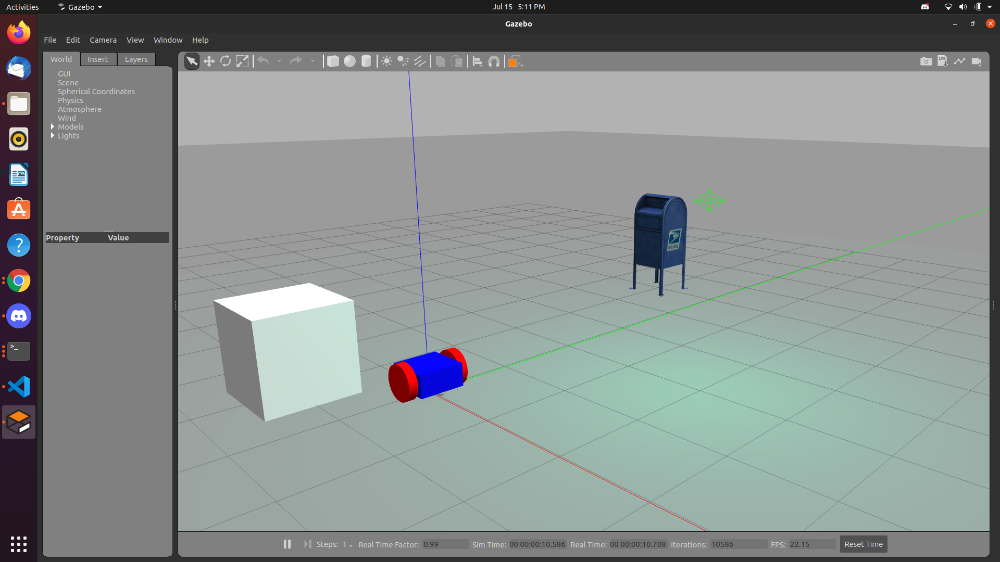

# Assignment-1
## Simulation

The code is in **assing_1/work/src/demo_bot_gazebo** folder

**Screen shot-**

**Screen recording-**

https://user-images.githubusercontent.com/77164297/125782718-5d6d2305-f066-4387-8ab9-797ee11e0a87.mp4

I have understood the urdf format, but I am having problem in finding locations of joints, calculating inertia , therefore I have taken code for robot from internet. Except that I have done everything on my own.
source for robot description- https://github.com/PacktPublishing/ROS-Robotics-By-Example/blob/master/Chapter_2_code/ros_robotics/urdf/dd_robot6.urdf